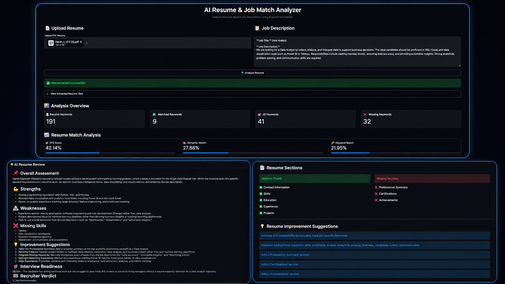
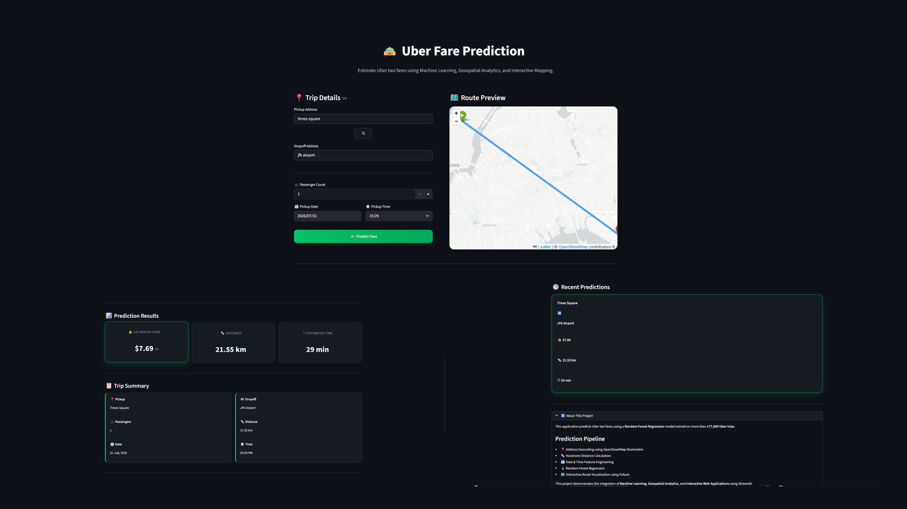
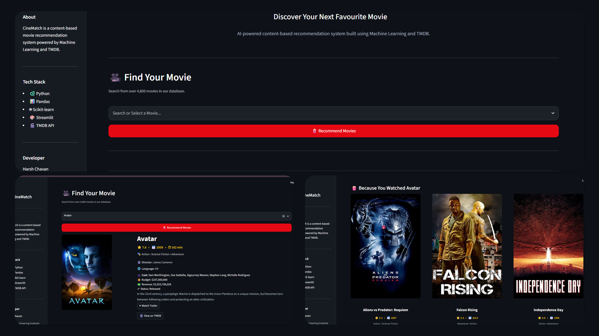

<div align="center">

# Harsh Chavan


<br>

<a href="https://github.com/harsh8767">

</a>

<a href="https://www.linkedin.com/in/harsh-chavan-1646a2257/">

</a>

<a href="mailto:harshchavan1403@gmail.com">

</a>

<br><br>


</div>

---

# 💫 Quick Highlights

<div align="center">

| 🤖 AI Projects | 🐍 Primary Language | 🌐 Deployments | 🧠 Current Focus |
|:--------------:|:------------------:|:--------------:|:----------------:|
| **3+ Production Projects** | **Python** | **Render · Railway · Vercel** | **Generative AI & NLP** |

</div>

---

# 👋 About Me

```python
class HarshChavan:

    def __init__(self):

        self.role = "Computer Engineering Graduate"

        self.specialization = [
            "Artificial Intelligence",
            "Machine Learning",
            "Data Science",
            "Python Development",
            "Full Stack Development"
        ]

        self.current_focus = [
            "Generative AI",
            "Natural Language Processing",
            "LLMs",
            "Building AI Products",
            "Production Deployment"
        ]

        self.motto = "Learn • Build • Deploy • Improve"
```

I'm passionate about building **production-ready AI applications** that solve **real-world problems** through intelligent software.

My interests span **Artificial Intelligence**, **Machine Learning**, **Natural Language Processing**, **Generative AI**, and **Full Stack Development**, where I enjoy transforming ideas into complete applications—from experimentation and model development to modern user interfaces and cloud deployment.

Rather than building notebook-only projects, I focus on creating polished software that combines **Machine Learning**, **clean UI/UX**, and **production deployment**.

---

# 🚀 What I'm Currently Working On

- 🤖 Building AI-powered applications with **Google Gemini**
- 📄 Resume Intelligence & ATS Optimization Systems
- 🎬 Intelligent Recommendation Engines
- 🚖 Machine Learning Prediction Applications
- 🌐 Deploying production-ready Streamlit applications
- 📚 Exploring Generative AI, LLMs & AI Workflows

---

# 🚀 Technologies I Work With

A collection of technologies, frameworks, libraries, and tools I use to build modern **Artificial Intelligence**, **Machine Learning**, **Data Science**, and **Full Stack** applications.

### 💻 Languages

<p align="center">


</p>

### 🌐 Web Development

<p align="center">


</p>

### 🤖 Artificial Intelligence

<p align="center">


</p>

### 📊 Machine Learning & Data Science

<p align="center">


</p>

### ⚙️ Frameworks

<p align="center">


</p>

### 🗄️ Database

<p align="center">


</p>

### ☁️ Deployment

<p align="center">


</p>

### 🛠️ Tools

<p align="center">


</p>

---

# 🚀 Featured Projects

Explore some of my favorite projects where I combine **Artificial Intelligence**, **Machine Learning**, **Natural Language Processing**, and **modern web technologies** to solve real-world problems.

---

## 🤖 AI Resume & Job Match Analyzer

<p align="center">
  
</p>

An AI-powered resume analysis platform that evaluates **ATS compatibility**, compares resumes against job descriptions, and provides intelligent improvement suggestions using **Google Gemini AI**.

### ✨ Key Features

📊 ATS Resume Score  
🤖 AI Resume Review  
📄 Resume Parsing  
🎯 Resume ↔ Job Description Matching  
🔍 Keyword Analysis  
🧠 Google Gemini Integration  
📥 PDF Report Generation  
🌐 Responsive Streamlit Interface

### 🛠️ Built With

<p align="center">


</p>

<p align="center">

<a href="https://ai-resume-analyzer-05rf.onrender.com/">

</a>

&nbsp;

<a href="https://github.com/harsh8767/AI-Resume-Analyzer">

</a>

</p>

<br>

---

<br>

## 🚖 Uber Fare Prediction

<p align="center">
  
</p>

A Machine Learning application that predicts Uber ride fares using **geospatial analytics**, feature engineering, and interactive visualizations to provide accurate fare estimations.

### ✨ Key Features

💰 Fare Prediction  
🗺️ Interactive Route Visualization  
📍 Pickup & Dropoff Analysis  
📏 Distance-Based Fare Estimation  
📊 Machine Learning Regression  
📈 Prediction Dashboard  
🕒 Prediction History  
🌐 Responsive Streamlit Interface

### 🛠️ Built With

<p align="center">


</p>

<p align="center">

<a href="https://uber-fare-prediction-b75r.onrender.com/">

</a>

&nbsp;

<a href="https://github.com/harsh8767/Uber-Fare-Prediction">

</a>

</p>

<br>

---

<br>

## 🎬 CineMatch

<p align="center">
  
</p>

A content-based movie recommendation system powered by **Machine Learning**, **TF-IDF**, and **Cosine Similarity**, delivering personalized recommendations through a clean and intuitive interface.

### ✨ Key Features

🎬 Content-Based Recommendations  
🔎 Smart Movie Search  
🎯 Similar Movie Suggestions  
📖 Detailed Movie Information  
⭐ Ratings & Genres  
🎞️ TMDB API Integration  
🧠 TF-IDF + Cosine Similarity  
🌐 Responsive Streamlit Interface

### 🛠️ Built With

<p align="center">


</p>

<p align="center">

<a href="https://harsh-cinematch.onrender.com/">

</a>

&nbsp;

<a href="https://github.com/harsh8767/CineMatch">

</a>

</p>

---

# 📊 GitHub Analytics

<div align="center">


</div>

<br>

<div align="center">


</div>

---

# 🏆 GitHub Achievements

<div align="center">


</div>

---

# 🎯 Current Focus

<table>

<tr>

<td width="50%" valign="top">

### 🚀 Building

- 🤖 AI-powered Applications
- 📄 Resume Intelligence Systems
- 🎬 Recommendation Engines
- 🚖 Machine Learning Products
- 🌐 Production-ready Streamlit Applications

</td>

<td width="50%" valign="top">

### 📚 Learning

- 🧠 Large Language Models (LLMs)
- 🔍 Retrieval-Augmented Generation (RAG)
- 🤖 AI Agents & Workflows
- 📄 Advanced NLP
- ⚙️ Backend System Design

</td>

</tr>

</table>

---

# 🏗️ Development Journey

```text
2023 ─────────────────────────────────────────────────────────► 2026

🌱 Started Programming with Python & C++

        │
        ▼

📊 Learned Data Analysis & Machine Learning

        │
        ▼

🤖 Built Production-Ready AI Applications

        │
        ▼

🌐 Developed & Deployed Full-Stack Projects

        │
        ▼

🚀 Exploring Generative AI, LLMs & Intelligent Systems
```

---

# 💼 Beyond the Code

I enjoy turning ideas into polished software by combining **Artificial Intelligence**, **Machine Learning**, **clean UI/UX**, and **cloud deployment**.

Every project I build is driven by one goal:

> **Solve a real-world problem while delivering an intuitive user experience.**

Whether it's helping job seekers optimize their resumes with AI, recommending movies using intelligent algorithms, or predicting Uber fares with Machine Learning, I enjoy building software that is practical, scalable, and impactful.

Beyond coding, I'm constantly exploring new AI technologies, improving my software engineering skills, and learning how to build intelligent systems that can move from prototype to production.

---

# 🎯 Goals for 2026

I'm continuously working toward becoming a well-rounded AI Engineer by focusing on both **Artificial Intelligence** and **Software Engineering**.

- 🚀 Build production-grade AI applications
- 🤖 Develop intelligent systems powered by LLMs
- 📚 Deepen expertise in Machine Learning & NLP
- ☁️ Learn scalable backend architecture & cloud deployment
- 🤝 Contribute to impactful open-source projects
- 📦 Design and launch complete end-to-end software products

---

# 🤝 Let's Connect

<div align="center">

I'd love to connect with fellow developers, AI enthusiasts, and recruiters.

<br>

<a href="mailto:harshchavan1403@gmail.com">

</a>

&nbsp;&nbsp;

<a href="https://www.linkedin.com/in/harsh-chavan-1646a2257/">

</a>

&nbsp;&nbsp;

<a href="https://github.com/harsh8767">

</a>

</div>

---

# 💡 Fun Fact

```text
I enjoy building complete AI products—not just Machine Learning models.

From idea ➜ data ➜ model ➜ backend ➜ UI ➜ deployment,
I love turning concepts into software that people can actually use.
```

---

# 📌 Quote I Live By

<div align="center">

> **"The best way to learn is by building."**

</div>

---

<div align="center">

### ⭐ Thanks for Visiting!

If you enjoyed exploring my projects, feel free to ⭐ any repository you find interesting.

<br>


</div>
