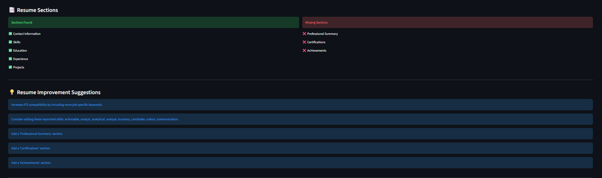
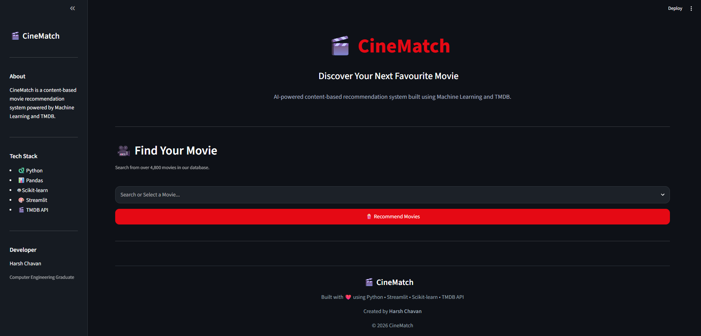

<div align="center">

# Harsh Chavan


<br>

<a href="https://github.com/harsh8767">

</a>

<a href="https://www.linkedin.com/in/harsh-chavan-1646a2257/">

</a>

<a href="mailto:harshchavan1403@gmail.com">

</a>

</div>

---

# 👋 About Me

```python
class HarshChavan:

    def __init__(self):
        self.role = "Computer Engineering Graduate"

        self.interests = [
            "Artificial Intelligence",
            "Machine Learning",
            "Data Science",
            "Python Development",
            "Full Stack Development"
        ]

        self.current_focus = [
            "Generative AI",
            "NLP",
            "Building AI Products",
            "Deploying ML Applications"
        ]

        self.motto = "Learn • Build • Deploy • Improve"
```

I'm passionate about creating **production-ready AI applications** that solve real-world problems.

My interests span across **Machine Learning**, **Natural Language Processing**, **Generative AI**, and **Full Stack Development**, where I enjoy taking an idea from experimentation to deployment.

Instead of building notebook-only projects, I enjoy developing complete applications with modern interfaces, intelligent backends, and cloud deployment.

---

# 🚀 What I'm Working On

- 🤖 AI-powered applications using Google Gemini
- 📄 Resume Analysis & ATS Optimization
- 🎬 Intelligent Recommendation Systems
- 🚕 Machine Learning Prediction Systems
- 🌐 Deploying production-ready Streamlit applications
- 📚 Continuously learning modern AI technologies

---

# 💻 Tech Stack

<div align="center">


</div>

<br>

### 🧠 Artificial Intelligence

<p>


</p>

---

### 📊 Machine Learning

<p>


</p>

---

### ☁ Deployment

<p>


</p>

---

<div align="center">

## ⭐ Featured Projects

> *Building AI-powered applications that solve practical problems.*

</div>

# 🚀 Featured Projects

---

<table>
<tr>
<td width="55%">

# 🤖 AI Resume Analyzer

### AI-powered Resume Intelligence Platform

A production-ready web application that helps job seekers optimize their resumes using **Google Gemini AI**, **Natural Language Processing**, and **ATS-based evaluation**.

### ✨ Key Features

- 📊 ATS Resume Score
- 🤖 AI Resume Review
- 📄 Resume Parsing
- 🎯 Resume ↔ Job Description Matching
- 🔍 Keyword Analysis
- 🧠 Google Gemini Integration
- 📥 PDF Report Generation
- 🌐 Responsive Streamlit UI

<br>

<a href="https://ai-resume-analyzer-05rf.onrender.com/">

</a>

<a href="https://github.com/harsh8767/AI-Resume-Analyzer">

</a>

</td>

<td width="45%">


</td>

</tr>
</table>

---

<table>
<tr>

<td width="45%">


</td>

<td width="55%">

### Why I Built It

Most resume tools only provide a score.

This application goes further by combining **ATS scoring**, **semantic similarity**, and **LLM-powered feedback** to generate practical suggestions that help improve resumes before applying for jobs.

</td>

</tr>

</table>

---

<table>

<tr>

<td width="45%">



</td>

<td width="55%">

### Tech Used

- Python
- Streamlit
- Google Gemini API
- Pandas
- NLP
- TF-IDF
- Cosine Similarity
- PDF Generation

</td>

</tr>

</table>

---

# 🎬 CineMatch

<table>

<tr>

<td width="55%">

### Content-Based Movie Recommendation Engine

Discover movies using Natural Language Processing and content similarity instead of ratings alone.

### ✨ Features

- 🎥 Smart Recommendations
- 🔍 Movie Search
- 📄 Detailed Movie Information
- ⭐ Ratings
- 🎭 Genres
- 🎬 Cast Information
- 🖼 Posters
- ⚡ Fast Recommendation Engine

<br>

<a href="https://harsh-cinematch.onrender.com/">

</a>

<a href="https://github.com/harsh8767/CineMatch">

</a>

</td>

<td width="45%">



</td>

</tr>

</table>

---

<table>

<tr>

<td width="45%">


</td>

<td width="55%">

### Recommendation Engine

Built using

- TF-IDF
- Cosine Similarity
- NLP
- TMDB Dataset

to recommend movies with similar content and themes.

</td>

</tr>

</table>

---

<table>

<tr>

<td width="45%">


</td>

<td width="55%">

### User Experience

The interface provides

- Detailed movie pages
- Poster previews
- Ratings
- Genres
- Similar movie suggestions

for a seamless discovery experience.

</td>

</tr>

</table>

---

# 📊 GitHub Analytics

<div align="center">


</div>

<br>

<div align="center">


</div>

---

# 🎯 Current Focus

<table>

<tr>

<td width="50%">

### 🚀 Building

- 🤖 AI-powered applications
- 📄 Resume Intelligence Systems
- 🎬 Recommendation Engines
- 🚕 Machine Learning Products
- 🌐 Production-ready Streamlit apps

</td>

<td width="50%">

### 📚 Learning

- Large Language Models (LLMs)
- Retrieval-Augmented Generation (RAG)
- AI Agents & Workflows
- Advanced NLP
- Backend System Design

</td>

</tr>

</table>

---

# 💼 Beyond the Code

I enjoy turning ideas into polished software by combining **AI, Machine Learning, clean UI design, and cloud deployment**.

Every project I build focuses on solving a real problem while delivering an intuitive user experience.

Whether it's improving resumes with AI, recommending movies, or predicting fares, my goal is to create applications that people genuinely enjoy using.

---
---

# 🏗️ Development Journey

```text
2023 ───────────────────────────────────────────────► 2026

🌱 Started with Python & C++

⬇

📊 Learned Data Analysis & Machine Learning

⬇

🤖 Built AI-powered Applications

⬇

🌐 Deployed Full-Stack Projects

⬇

🚀 Exploring Generative AI, LLMs & Production Systems
```

---

# 📌 Featured Technologies

<div align="center">


<br><br>


</div>

---

# 🌟 Why These Projects Matter

<table>

<tr>

<td width="33%" align="center">

### 🤖 AI Resume Analyzer

Helping job seekers improve resumes using Artificial Intelligence, NLP and ATS analysis.

</td>

<td width="33%" align="center">

### 🎬 CineMatch

Helping users discover movies through content-based recommendation instead of generic popularity rankings.

</td>

<td width="33%" align="center">

### 🚕 Uber Fare Prediction

Using Machine Learning to estimate ride fares with geospatial features and interactive visualization.

</td>

</tr>

</table>

---

# 📈 Goals for 2026

- 🚀 Build production-grade AI applications
- 🤝 Contribute to open-source projects
- 🧠 Deepen expertise in Generative AI & LLMs
- ☁️ Learn scalable backend architecture
- 📦 Develop end-to-end software products

---
# 🤝 Let's Connect

<div align="center">

<a href="mailto:harshchavan1403@gmail.com">

</a>

&nbsp;

<a href="https://github.com/harsh8767">

</a>

&nbsp;

<a href="https://www.linkedin.com/in/harsh-chavan-1646a2257/">

</a>

</div>

---

<div align="center">

### ⭐ Thanks for stopping by!

*"Building intelligent software that solves real-world problems."*


</div>

